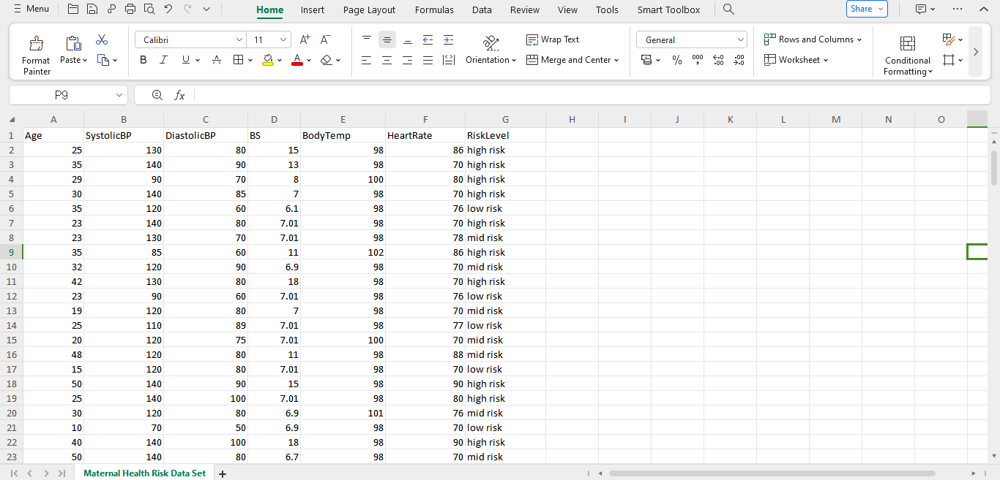
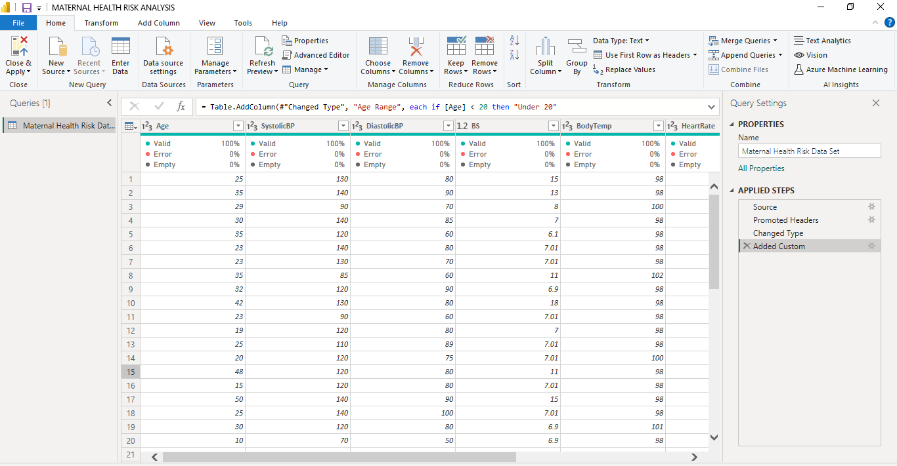
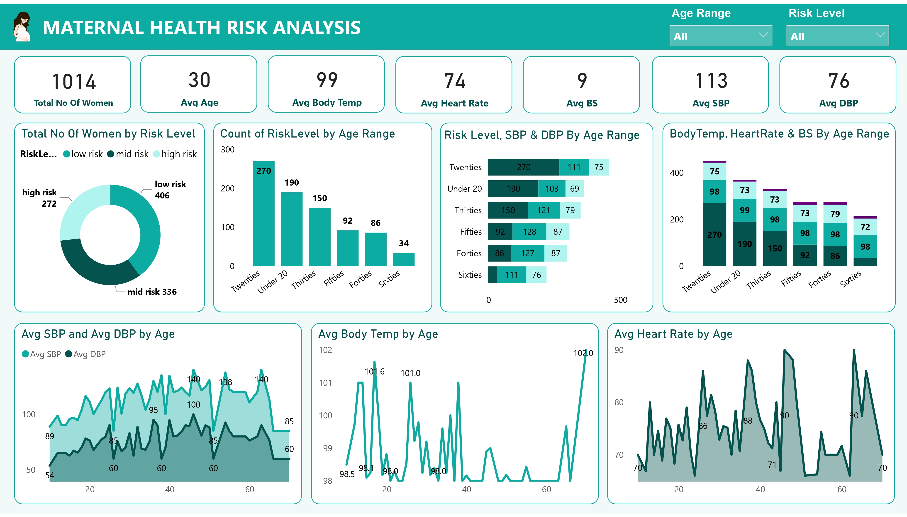
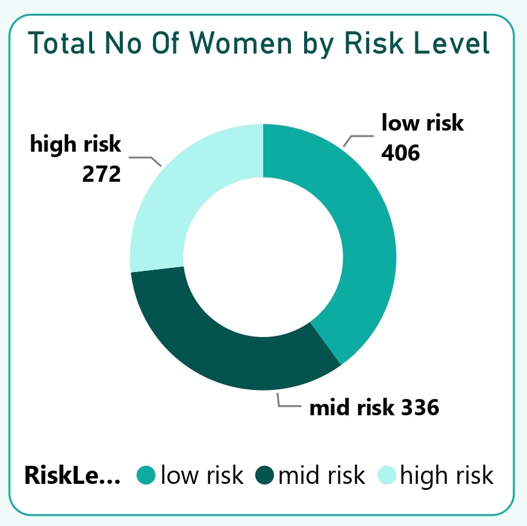
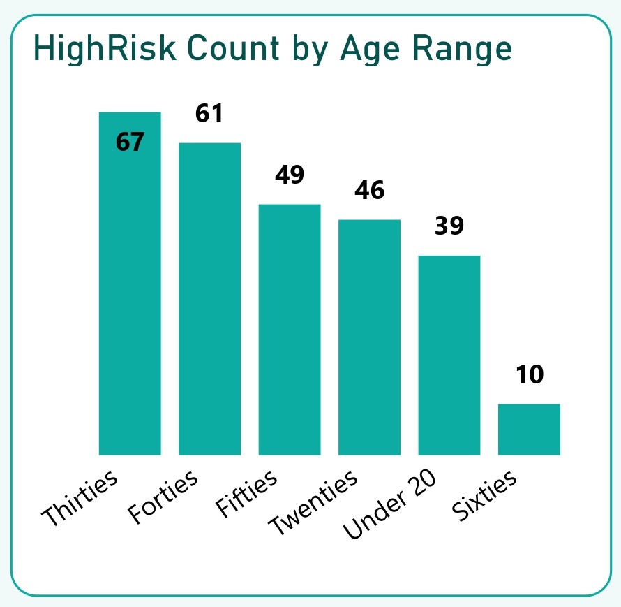

# Maternal Health Risk Analysis

## Project Overview
### Introduction:
Maternal health is a critical component of public health, directly impacting the well-being of mothers and their newborns. Despite significant advancements in medical technology and healthcare infrastructure, maternal mortality and morbidity rates remain high in many parts of the world. This project aims to conduct a comprehensive analysis of maternal health risks to identify key factors contributing to adverse maternal outcomes.

### Objectives:
- __Assess risk distribution:__ Evaluate the distribution of maternal health risks among women by analyzing the total number of women categorized by risk levels.
- __Age-specific risk analysis:__ Investigate the relationship between age and maternal health risks by examining the number of risk levels across different age ranges.
- __Health parameters by risk level and age:__ Explore the variations in health parameters such as systolic blood pressure (SBP), diastolic blood pressure (DBP), body temperature (Temp), heart rate (HR), and blood sugar (BS) across different risk levels and age groups.
- __Average health parameters by age:__ Calculate the average SBP, DBP, body temperature, and heart rate for each age range to understand age-related trends in maternal health.

### Expected Outcomes:
- __Risk distribution profile:__ Obtain insights into the prevalence of maternal health risks by determining the total number of women in each risk category.
- __Age-risk correlation:__ Identify correlations between age and maternal health risks by examining the distribution of high risk levels across different age ranges.
- __Health parameter variations:__ Understand how health parameters such as SBP, DBP, body temperature, heart rate, and blood sugar vary across risk levels and age groups.
- __Age-related trends:__ Determine average values of health parameters for each age range, revealing age-related patterns in maternal health indicators.

### Dataset Overview:
The data has been collected from different hospitals, community clinics, and maternal health cares through the IoT-based risk monitoring system. The dataset comprises of vital information crucial for a deep insight into the Maternal Health Risk levels, patterns and demography. It includes details such as Age,	SystolicBP,	DiastolicBP,	BS,	BodyTemp,	HeartRate, and	RiskLevel. By analyzing this dataset, we aim to uncover maternal health risk levels, trends, and correlations that offer valuable insights into maternal health risk across different demographics.

This dataset is a CSV file made up of a single table named Maternal_Health_Risk_Dataset.csv and was provided by [Quantum Analytics](https://www.quantumanalyticsco.org/). You can click on this [link](Maternal%20Health%20Risk%20Data%20Set.csv) to access the raw data file. This dataset table is made up of 7 columns and 1,014 rows of data.  

Here's is a detailed information of the columns we have in this dataset to aid a better understanding of this analysis:
- __Age:__ This column represents the age of the individuals being analyzed in this analysis. Age is typically measured in years and serves as a demographic variable. In the context of maternal health risk analysis, age is an important factor as maternal health risks can vary based on the age of the mother.
- __SystolicBP (Systolic Blood Pressure):__ Systolic blood pressure (SBP) is the maximum pressure exerted by the blood against the arterial walls when the heart contracts and pumps blood out during a heartbeat. It is the higher number in a blood pressure reading, typically measured in millimeters of mercury (mmHg). Elevated systolic blood pressure can indicate hypertension or other cardiovascular health issues.
- __DiastolicBP (Diastolic Blood Pressure):__ Diastolic blood pressure (DBP) is the minimum pressure exerted by the blood against the arterial walls when the heart is at rest between beats. It is the lower number in a blood pressure reading, also measured in millimeters of mercury (mmHg). Elevated diastolic blood pressure can also indicate hypertension or other cardiovascular health issues.
- __BS (Blood Sugar):__ Blood sugar refers to the concentration of glucose in the bloodstream. It is typically measured in milligrams per deciliter (mg/dL) or millimoles per liter (mmol/L). Monitoring blood sugar levels is important for assessing metabolic health and detecting conditions such as diabetes mellitus.
- __BodyTemp (Body Temperature):__ Body temperature represents the degree of heat generated by the body, usually measured in degrees Celsius (°C) or Fahrenheit (°F). Normal body temperature ranges between 36.5 to 37.5 degrees Celsius (97.7 to 99.5 degrees Fahrenheit). Abnormal body temperature can indicate fever or other health conditions.
- __HeartRate:__ Heart rate refers to the number of heartbeats per minute (bpm). It is an indicator of cardiovascular health and can vary depending on factors such as age, fitness level, and activity level. Resting heart rate typically falls within a range of 60 to 100 beats per minute for adults.
- __RiskLevel:__ Risk level categorizes individuals into different risk groups based on predefined criteria related to maternal health risks. It is a qualitative variable indicating the likelihood of experiencing adverse maternal outcomes such as complications during pregnancy, childbirth, or postpartum. Risk levels can be determined based on various factors including medical history, demographic characteristics, and health indicators like blood pressure and blood sugar levels.

### Tools Used
1. Power Query Editor
    - Was used to:
        1. Extract,
        2. Transform, and
        3. Load all the datasets for this analysis.
           
2. Power BI (Was used to create reports and dashboard for this analysis)
    - The following Power BI Features were incorporated:
        1. DAX
        2. Quick Measures
        3. Filters
        4. Tooltips

### Data Cleaning, Transformation and Loading using the Power Query Editor:
1. I transformed all column data types to the right data types.
2. I added a new column __"Age Band"__ and filled it up with the data extraced from the __"Age"__ column which was grouped into _"Under Twenties, Twenties, Thirties, Forties, Fifties, and Sixties"_ using the "If function".
3. Made sure that all columns have no data error or null values, and that all coumns have the __100%__ Valid Mark.

**Raw Data**
- Below a screenshot of a part of the raw data in .csv file format. You can download the dataset [here](images/Maternal%20Health%20Risk%20Data%20Set.csv).

**Final Power Query Editor screenshot**
- Below is a screenshot of a part of the cleaned data in power query editor. You can access the full Power BI project document [here](https://github.com/Ugochukwuodinaka/Maternal-Health-Risk-Analysis/blob/main/MATERNAL%20HEALTH%20RISK%20ANALYSIS.pbix).

## Data Modelling
No data modelling was required since we need just a table for the analysis.

## Visualization in Power BI:
#### Report Image

### Project Analysis:
From the analysis, i made the Key Performance findings below:
- The Total Number of Women used for this analysis is __1,014__.
- The Average Age of Women in this analysis is __30__.
- The Average Body Temperature of Women in this analysis is __99 F__.
- The Average Heart Rate of Women in this analysis is __74 bpm__.
- The Average Systolic Blood Pressure of Women in this analysis is __113 mmHg__.
- The Average Diastolic Blood Pressure of Women in this analysis is __76 mmHg__.
- The Average Blood Sugar of Women in this analysis is __9 mmol/L__.

- 
- **The Total Number of Women By Risk Level:**
- In this analysis, there is a dominance of the Low-Risk Category. The data shows that the majority of women in the sample are classified as low risk, accounting for 40.04% of the total. This dominance suggests that a significant portion of the population is considered to have a lower likelihood of experiencing adverse maternal outcomes. These women may have favorable health indicators, such as stable blood pressure, normal blood sugar levels, and overall good health.
- Following the low-risk category, the mid-risk group comprises a substantial proportion of the sample, with 33.14% of women falling into this category. This indicates a notable presence of women who may have certain health factors or conditions that elevate their risk of experiencing maternal complications. 
- While the high-risk category represents the smallest proportion of women in the sample at 26.82%, it remains a significant concern due to the heightened likelihood of adverse maternal outcomes among this population. Women classified as high risk may have underlying health conditions, advanced maternal age, or other factors that increase their susceptibility to complications during pregnancy, childbirth, or the postpartum period.
  
- __Implications for Maternal Healthcare:__ The distribution of women across different risk categories underscores the importance of risk assessment and personalized care in maternal healthcare settings. By accurately identifying women at varying levels of risk, healthcare providers can tailor interventions, monitoring, and support to meet the specific needs of each group. This approach can help mitigate potential risks, improve maternal health outcomes, and enhance the overall quality of care provided to pregnant and postpartum women.
- __Need for Targeted Interventions:__ The disparities in risk distribution highlight the heterogeneity of maternal health risks within the population under study. Factors such as age, pre-existing health conditions, socio-economic status, and access to healthcare services may contribute to variations in risk levels among women. Targeted interventions and public health initiatives are needed to address these disparities and ensure equitable access to maternal healthcare resources and support.

- 
- **Count of Women On High Risk Level By Age Range:**
- In this analysis, Women in their thirties comprise the largest group among those classified as high risk, with 67 individuals. This age range is followed closely by women in their forties, fifties, and twenties, with 61, 49, and 46 women, respectively. Additionally, there are 39 women under the age of 20 and only 10 women in their sixties classified as high risk.
- __Correlation Between Age and Maternal Health Risks:__ The data suggests a notable correlation between age and maternal health risks. Women in their thirties and forties, commonly considered as advanced maternal age, show higher counts of individuals classified as high risk. This aligns with existing literature indicating that advanced maternal age is associated with increased risk of pregnancy complications and adverse maternal outcomes.
- Conversely, women in their twenties and under the age of 20 also show a considerable number of individuals classified as high risk. This may reflect factors such as socio-economic disparities, inadequate prenatal care, and underlying health conditions prevalent in younger age groups that contribute to elevated maternal health risks.
- The lower count of women in their sixties classified as high risk could be attributed to factors such as menopause and decreased fertility rates, resulting in fewer pregnancies in this age group. However, it's essential to note that maternal health risks can still exist in older age groups due to age-related health issues and complications during pregnancy.

- __Implications for Maternal Healthcare:__ The distribution of high-risk levels across different age ranges underscores the importance of tailored and age-specific approaches to maternal healthcare. Healthcare providers should consider age as a crucial factor in assessing maternal health risks, providing prenatal care, and implementing preventive measures to mitigate potential complications.
- __Need for Comprehensive Risk Assessment:__ While age is an important determinant of maternal health risks, it's essential to recognize that other factors such as pre-existing medical conditions, socio-economic status, lifestyle factors, and access to healthcare also play significant roles.

- 
- **Average Body Temperature, Heart Rate, and Blood Sugar By Age Range:**
- In this analysis, the of average body temperature, heart rate, and blood sugar by age range provides valuable insights into the variations in health parameters across different age groups.
- __Body Temperature:__ The data reveals slight variations in average body temperature across age groups. Younger age groups, such as those under 20 and in their twenties, tend to have slightly higher average body temperatures compared to older age groups. This is consistent with physiological norms, as body temperature generally decreases with age due to changes in metabolism and thermoregulation. However, the differences in average body temperature among age groups are relatively small, with all age groups falling within the normal range of body temperature (typically around 98.6°F or 37°C). This suggests that age may not be a significant determinant of variations in body temperature within the population studied.
- __Heart Rate:__ There is noticeable variability in average heart rate across different age groups. Younger individuals, particularly those in their twenties and forties, tend to have higher average heart rates compared to older age groups. This could be attributed to factors such as higher levels of physical activity, increased metabolic rate, and overall cardiovascular health. Conversely, older age groups, such as those in their fifties and sixties, exhibit slightly lower average heart rates. This could be indicative of age-related changes in heart function, decreased cardiac efficiency, and changes in autonomic nervous system regulation.
- __Blood Sugar:__ The data reveals significant variations in average blood sugar levels across different age groups. Older age groups, particularly those in their forties, fifties, and sixties, tend to have higher average blood sugar levels compared to younger age groups. This is consistent with the increased prevalence of insulin resistance, impaired glucose tolerance, and diabetes mellitus with advancing age. Younger age groups, such as those under 20 and in their twenties, demonstrate lower average blood sugar levels. This could be attributed to factors such as healthier dietary habits, higher physical activity levels, and better glucose metabolism in younger individuals.
- In summary, the analysis highlights the variations in health parameters across different age groups, emphasizing the importance of age-specific health monitoring and interventions in promoting optimal health and wellness. 

- 
- **Average Body Temperature, Heart Rate, and Blood Sugar By Age Range:**
- In this analysis

