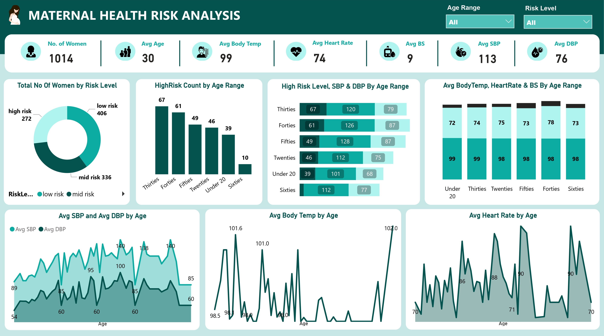

# Maternal Health Risk Analysis

 

## Table of Contents
- [Project Overview](#project-overview)
- [Dataset Overview](#dataset-overview)
- [Tools Used](#tools-used)
- [Visualization in Power BI](#visualization-in-power-bi)
- [Project Analysis](#project-analysis)
- [Visuals in Power BI Report](#visuals-in-power-bi-report)
- [Recommendations On How To Improve Maternal Health](#recommendations-on-how-to-improve-maternal-health)
 

## Project Overview
### Introduction:
Maternal health is a very important part of the public health of a society which accordingly not only influences the welfare of mothers but also of their newborn infants. Although significant strides have been made in medical technology and healthcare infrastructure, maternal mortality and morbidity rates are still high in many parts of the world. This project aims to carry out a thorough examination of maternal health risks with the view of pointing out the key factors that are responsible for adverse maternal outcomes.

### Objectives:
- __Risk Distribution Assessment:__ Get an overview of the distribution of the risks to maternal health among women by viewing the total number of women categorized by risk levels.
- __Age-specific risk analysis:__ The relationship in this case study is between age and maternal health risks, understood through the different levels of risk broken down by various age brackets.
- __Health parameters by risk level and age groups:__ The health parameters, such as SBP, DBP, Temp, HR, and BS values, have to be analyzed across the range from the lowest to the highest of patients falling under different age groups.
- __Average health parameters according to age:__ The average for SBP, DBP, temperature of the body, and heart rate needs to be calculated for different ranges of ages. This will help in getting a trend with aging in maternal health parameters.

### Expected Outcomes:
- __Risk distribution profile:__ Obtain insights into the prevalence of maternal health risks by determining the total number of women in each risk category.
- __Age-risk correlation:__ Identify correlations between age and maternal health risks by examining the distribution of high risk levels across different age ranges.
- __Health parameter variations:__ Understand how health parameters such as SBP, DBP, body temperature, heart rate, and blood sugar vary across risk levels and age groups.
- __Age-related trends:__ Determine average values of health parameters for each age range, revealing age-related patterns in maternal health indicators.
 
 

### Dataset Overview:
The IoT-based risk monitoring system recovers data from several hospitals, community clinics, and maternal health cares. This dataset contains vital information of prime importance for gaining insight into the risk levels, patterns, and demography related to maternal health. It has information on things like Age, SystolicBP, DiastolicBP, BS, BodyTemp, HeartRate, and RiskLevel. We will analyze this dataset to determine maternal health risk levels, trends, and correlations that can turn out to be useful in gaining insight into the maternal health risk across different demographics.

This dataset is a single table, in a CSV file named Maternal_Health_Risk_Dataset.csv, supplied by. You can access the raw data here through this [link](Maternal%20Health%20Risk%20Data%20Set.csv). There are 7 columns and 1,014 rows of data in this dataset table.

Here's is a detailed information of the columns we have in this dataset to aid a better understanding of this analysis:
| Table                              | Field                    | Description                            |            
|:-----------------------------------|:------------------------ |:-------------------------------------- |
|Maternal_Health_Risk_Dataset.csv    | Age                      | This column represents the age of the individuals being analyzed in this analysis. Age is typically measured in years and serves as a demographic variable. In the context of maternal health risk analysis, age is an important factor as maternal health risks can vary based on the age of the mother.    |
|                                    | SystolicBP (Systolic Blood Pressure)| Systolic blood pressure (SBP) is the maximum pressure exerted by the blood against the arterial walls when the heart contracts and pumps blood out during a heartbeat. It is the higher number in a blood pressure reading, typically measured in millimeters of mercury (mmHg). Elevated systolic blood pressure can indicate hypertension or other cardiovascular health issues.    |
|                                    | DiastolicBP (Diastolic Blood Pressure)| Diastolic blood pressure (DBP) is the minimum pressure exerted by the blood against the arterial walls when the heart is at rest between beats. It is the lower number in a blood pressure reading, also measured in millimeters of mercury (mmHg). Elevated diastolic blood pressure can also indicate hypertension or other cardiovascular health issues.        |
|                                    | BS (Blood Sugar)         | Blood sugar refers to the concentration of glucose in the bloodstream. It is typically measured in milligrams per deciliter (mg/dL) or millimoles per liter (mmol/L). Monitoring blood sugar levels is important for assessing metabolic health and detecting conditions such as diabetes mellitus.        |
|                                    | BodyTemp (Body Temperature)| Body temperature represents the degree of heat generated by the body, usually measured in degrees Celsius (°C) or Fahrenheit (°F). Normal body temperature ranges between 36.5 to 37.5 degrees Celsius (97.7 to 99.5 degrees Fahrenheit). Abnormal body temperature can indicate fever or other health conditions.       |
|                                    | HeartRate                | Heart rate refers to the number of heartbeats per minute (bpm). It is an indicator of cardiovascular health and can vary depending on factors such as age, fitness level, and activity level. Resting heart rate typically falls within a range of 60 to 100 beats per minute for adults.         |
|                                    | RiskLevel                | Risk level categorizes individuals into different risk groups based on predefined criteria related to maternal health risks. It is a qualitative variable indicating the likelihood of experiencing adverse maternal outcomes such as complications during pregnancy, childbirth, or postpartum. Risk levels can be determined based on various factors including medical history, demographic characteristics, and health indicators like blood pressure and blood sugar levels.      |
 

### Skills Utilized
1. Data Cleaning
2. Data Visualiziation
3. Descriptive Analytics
4. Critical Thinking and Problem Solving
5. Communication and Reporting
 

### Tools Used
1. MySQL
    - Was used to:
        1. Extract,
        2. Clean,
        3. and Transform the datasets for this analysis.
           
2. Power BI (Was used to create reports and dashboard for this analysis)
    - The following Power BI Features were incorporated:
        1. DAX
        2. Quick Measures
        3. Filters
        4. Tooltips
 

### Data Cleaning and Transformation in MySQL:
1. Checked to confirm all column datatypes.
2. Added a new column __"AgeBand"__ which extracts its information from the __"Age"__ column and groups them into: _Under Twenties, Twenties, Thirties, Forties, Fifties, and Sixties_ using the _"Update"_ and _"Set query"_.
3. Re-ordered all columns appropriately.
4. Made sure that all the columns are of the right column types.

**Raw Data**
- Below is a screenshot of a part of the raw data in .csv file format.

Raw Data  Screenshot                                                          |                                
:----------------------------------------------------------------------------:|

You can preview the dataset [here](Maternal%20Health%20Risk%20Data%20Set.csv).
 
 

**Final MySQL screenshot**
- Below is a screenshot of a part of the cleaned data in MySQL. 

Sql Query Screenshot                                                               |                       
:---------------------------------------------------------------------------------:|
   

You can preview the MySQL query file [here](maternal_health_risk_data.sql)
 
 

## Data Modelling
No data modelling was required since we needed just a table for the analysis.
 
 

## Visualization in Power BI:
### Report Image

 
 

### Project Analysis:
From the analysis, i made the below key findings:
- The Total Number of Women used for this analysis: __1,014__.
- The Average Age of Women in this analysis: __30__.
- The Average Body Temperature of Women in this analysis: __99 F__.
- The Average Heart Rate of Women in this analysis: __74 bpm__.
- The Average Systolic Blood Pressure of Women in this analysis: __113 mmHg__.
- The Average Diastolic Blood Pressure of Women in this analysis: __76 mmHg__.
- The Average Blood Sugar of Women in this analysis: __9 mmol/L__.
 
 

- 

- **The Total Number of Women By Risk Level:**
- In the risk prediction, the Low-Risk Category is dominant. The dataset: indicated that this sample has nearly the highest number of females who were classified as low risk, approximately 40.04% of the whole population. Such dominance therefore means a large segment of the population might be considered of a lower risk of deteriorating maternal outcomes. These are the kind of women that might have good health values like blood pressure, stable blood sugar, normal blood pressure, and basically being healthy.
- The mid-risk group comes immediately after the low-risk category, and this group has 33.14% women in its calculation base. This reflects the fair presence of females with some sort of health factors or conditions that level their risks of facing maternal complications.
- Though 26.82% is the lowest percentage of the sample comprising women; this remains of grave concern because of the high likelihood of poor maternal outcomes in that population. Women in the high-risk category may have labelable risk factors, underlying medical conditions, or any other factor that might elevate the risk of complications in the course of pregnancy, childbirth, or the puerperium.
 
 

- 

- **Count of Women On High Risk Level By Age Range:**
- It is observed that 67 women in their thirties represent the highest number of those classified as high-risk. They were closely followed by women in their forties, fifties, and twenties numbering 61, 49, and 46, respectively. Other categories are 39 women below the age of 20 and only 10 women in their sixties that are classified as high risk.
- __Age and Relationship with Maternal Health Risks:__ The results show a significant relationship between age and maternal health risk. In the case of women in their thirties and forties—advanced maternal age—one finds more cases labeled as high risk. This goes per the available literature, which states that advanced maternal age is correlated to an increased risk of complications in pregnancy and adverse maternal outcomes.
- On the other hand, for women in their twenties and under the age of 20, a considerable number of people are also returned as high risk. This could be indicative of factors such as socioeconomic disparities, poor prenatal care, and underlying health conditions common in younger age groups that put them at higher maternal health risks.
- The lower count of women in their sixties classified as being at high-risk/older age groups could be due to reasons such as menopause and reduced fertility rates that lead to fewer pregnancies. However, one must be aware that there are risks associated with maternal health in advanced age groups because of ailments related to old age and problems associated with pregnancy.
 
 

- 

- **High Risk Level, SBP & DBP By Age Range:**
- In this analysis, we are going to look further into the insights about the distribution of high-risk levels, average systolic blood pressure, and average diastolic blood pressure across various age brackets of women. Now, let's look at the relationships between age and risks to health of mothers with these findings:
- __High-Risk Level Distribution:__ From the data, there is a different distribution of high-risk levels across several age groups of women. In this category, the highest number of high-risk cases was contributed by women in their thirties, with 67 people identified to be high risk, followed by women in their forties, fifties, twenties, under 20, and lastly, women in their sixties. It clearly indicates that maternal health risks are prevalent in particular age groups of women, normally those in their thirties and forties.
- __Average SBP and DBP__: There is a clear increasing trend of average SBP and DBP with advancing age among women. The highest average SBP and DBP among the age groups were found in women in their fifties and were closely followed by those in their forties. Mean values of SBP and DBP are lower in younger females belonging to age groups 20 and below 20, compared to older age groups. These changes in the average SBP and DBP across these different age groups have to be interpreted as age-related changes in cardiovascular health and maternal health.
- __Age and Maternal Risks:__ From the findings, there is a relation between age and maternal health risks where women in older age brackets generally had higher mean SBP and DBP values, with a higher percentage of high-risk cases. These elevated blood pressure levels are thought to have been an indicator of increased risk for hypertensive disorders of pregnancy, such as preeclampsia and gestational hypertension in these women, particularly in their forties and fifties. The younger age categories, such as women in their twenties and under 20, record less than the average blood pressure levels but have a good number of high-risk cases, which indicate other predisposing factors to the risks of maternal health.
 
 
  
- 

- **Average Body Temperature, Heart Rate, and Blood Sugar By Age Range:**
- The values regarding average body temperature, heart rate, and blood sugar analyzed in this work for different age ranges are very educative in respect to changes in health parameters with age.
- __Body Temperature:__ From the graph, it shows slight variations in average body temperature among different age groups. In the graph below, subjects in younger age groups are observed to have slightly higher temperature averages compared to those in older age groups, a phenomenon that conforms with physiological norms since, with age, body temperature goes down due to changes in metabolism and thermoregulation. The difference in mean body temperature among age groups, however, was relatively small, with all age groups still within the normal range of body temperature, usually taken to be 98.6°F or 37°C. Age may not be a significant determinant for explaining the variation of body temperature in this population under study.
- __Heart Rate:__ There is a visible variation in average heart rate among age classes. Younger age classes, in particular those in their twenties and forties, resulted in higher values for average heart rate in comparison with older age classes. Again, this most probably occurs due to the higher amounts of physical activity, increased metabolic rate, and overall cardiovascular health. On the other hand, slightly lower average heart rates were seen in older age decades, those in their fifties and sixties. This might indicate age-related changes in heart function with reduced cardiac efficiency and autonomic nervous system regulation.
- __Blood Sugar:__ According to the information depicted, there were generally overwhelming disparities in the average levels of blood sugar among these various age categories. However, it is indicated that the older age categories, mainly those in their forties, fifties, and sixties, had higher average blood sugar levels as opposed to the younger age categories. This is explained by the fact that with aging, there is evidence of increased insulin resistance, impaired glucose tolerance, and diabetes mellitus. The trend for younger age brackets, particularly the under-20 and in-their-twenties age groups, is to have lower than average blood sugar levels. This can be attributed to healthier dietary practice, higher activity levels, and better glucose metabolism in younger individuals.
 
 

- 

- **Average Systolic Blood Pressure and Diastolic Blood Pressure By Age:**
- Let's investigate the trends of SystolicBP and DiastolicBP across different ages in this analysis report.
- __Systolic Blood Pressure:__ You may notice that the systolic blood pressure progressively rises up from ages 10 to 50, overall. However, occasional fluctuations are seen within this gradient. Unlike any other, the systolic blood pressure displayed a steep climb and started hitting over 120 mmHg mid-twenties. From there on, a significant part of the population continued expressing these steep increments till mid-forties as suggested by the CSL graphed underneath it. After 50 years of age, systolic blood pressure appears to rise, with values spanning from 110 to 140 mmHg, which indicates potential differences in health and lifestyle factors.
- __Diastolic Blood Pressure:__ Same with DBP, starting from age 10 and walking to at least 50, the data clearly shows consistent rising trends with age in all clusters on the CSL graph (except at about age 14, 19, and 28). Like in the case of SBP, DBP surpasses the 80 mmHg threshold from the age of 28 and continues to climb until the age of 50, indicating HTN risk among these age groups. With advanced age, DBP seems to be more stable, but occasional fluctuations are evident in the subjects over the age of 50.
- In summary, our results provide evidence of an age-dependent relationship with blood pressure. Linear regression from the older to middle-aged individuals again supports the notion of higher blood pressure in older patients. This underscores the crucial need for age-specific monitoring and treatment of blood pressure, which could improve cardiovascular health and prevent long-term negative outcomes from hypertension steadily rising with advancing age. Unsuspectingly, young adults have higher mean specific systolic blood pressure range and so do middle-aged adults contrasted with older individuals.
 
 

- 

- **Average Body Temperature By Age:**
- We will consider an analysis where we have information containing data on body temperature in the different age groups. Let's see how it varies across different ages:
- __Changes in Body Temperature:__ The temperature of the body differs amongst the different age groups, which marks indicative physiological changes taking place with advancement in age and some disorders in health. In this dataset analysis, we can see a fluctuation of body temperature depending on age, with some ages demonstrating a comparatively higher or lower average temperature than others.
- The range of the values of the body temperature is quite large, from about 98°F to 102°F.For example, the youngest age groups, in their teens and twenties, recorded comparative lower average body temperatures, all at about 98°F and 99°F. On the other hand, some of the older age groups—the forties and fifties age groups—recorded higher readings in terms of average body temperatures, with the value sometimes going above 99°F. This will necessarily imply that body temperature may vary due to factors such as ambient conditions, amount of physical activity undertaken, and underlying health status. Thus, variations in body temperature across age groups are likely to be some function of these variables.
- The overview from the data follows different ranges of temperature readings in different age groups. Usually, fluctuations in body temperature are a normal process. However, considering increasing temperature readings and in health assessment or medical evaluations, one needs to keep a close check on any change in temperatures.
 
 

- 

- **Average Heart Rate By Age:**
- In this case, we are interested in analyzing the pulse rate data based on different age ranges. Consider now the way pulse changes with these ranges of ages:
- __Heart Rate Variations:__ Heart rate, which is measured in beats per minute, is influenced by various variables, such as the age of a person, the amount of fitness a person has attained, the degree and type of activity, and the state of health.
- This analysis easily notes the changes in heart rate from one age group to another, where some ages have an upper or lower average rate compared to other ages. The mean heart rate varies about from 66 to 90 BPM for all age groups in the analysis. Generally, teenagers and young adults in their twenties record lower average rates of about 66-80 beats per minute. Now, there is a slight run of older age groups—in their forties, fifties, and sixties—where the average heart rate can be a bit higher, even topping 80 bpm. Keep in mind that heart rate is an extremely variable individual characteristic. Factors such as level of physical condition, medication, or hidden disease may strongly influence the heart rate.
- The graph depicts changes in heart rate with varying age groups. It is expected that there will be fluctuations, for this is a normal variation that may be affected by many factors, at times even none. However, it can turn out to be very useful and enlightening to monitor trends of heart rate over time as an indicator of cardiovascular health and general well-being.
 
 

## Visuals in Power BI Report:
You can view and interact with this dashboard report on Maternal Health Risk Analysis [here](https://app.powerbi.com/view?r=eyJrIjoiZmE1YmVhNjUtNjgzOC00OTBkLTlmYTQtZmUxODgzNzJjNGYwIiwidCI6IjdlYzI5NjU5LTNjZjItNGYzZi1hYmIzLWE3MjJlZGY3ZmYyZCJ9).
 
 
 

## Recommendations On How To Improve Maternal Health 
- __Accessible and Increased Prenatal Care:__ Health policy planners in the health sector need to be sure that every woman about to give birth must get routine antenatal checkups and testing to keep track of the health condition of a mother-to-be and monitor any complications at its earlier stages.
- __Maternity Health Education:__ Full and appropriate information and health education on healthy pregnancy practices, including good nutrition, proper exercise, and the use of prenatal vitamins, must also be provided to expectant mothers and their families.
- __Improved Emergency Obstetric Care:__ Access to emergency obstetric care facilities and skilled birth attendants for the management of complications in childbirth that contribute to high maternal mortality rates should be enhanced.
- __Stronger Postnatal Support:__ Health administrators must provide postnatal care services to mothers and newborns addressing the immediate needs of the postpartum period. It would include support related to breastfeeding, newborn care, and monitoring postpartum complications.
- __Address Socioeconomic Determinants:__ They will have to address the social and economic factors bearing upon health outcomes of mothers through targeted interventions and social support programs—like poverty, lack of education, and gender inequality.
- __Invest in Maternal Nutrition:__ They should promote maternal nutrition by providing access to food that is good in nutrition, prenatal supplements, and education in nutrition, which can help provide support for healthy pregnancies and fetal development.
- __Community-Based Maternity Health Promotion:__ The latter's services have to be strengthened by capacity development and training in the provision of basic health services and support to pregnant women by community health workers in respective communities.
- Those simple recommendations, if acted upon, can greatly benefit the improvement of maternal health and significantly reduce mortality rates by ensuring that each woman receives all necessary care and help at this critical stage in her life.
 
 

## Thank You For Following Through!

